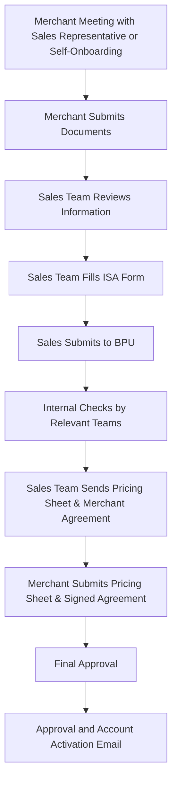

## **Merchant Onboarding Flow**

## **Checklist of Required Documents**

<Accordion title="Business Owner / UBO (Ultimate Beneficial Owner)">
  - **Name**
  - **Personal Address**
  - **Date of Birth**
  - **Face Image**
  - **Gender**
  - **ID CARD**: Passport, My Number, or Driver's License with:
    - ID Number
    - Issue Date
    - Expiry Date
</Accordion>

<Accordion title="Person of Contact">
  - **Name**
  - **Personal Address**
  - **Date of Birth**
  - **Face Image**
  - **Gender**
  - **ID CARD**: Passport, My Number, or Driver's License
  - **Email Address**
  - **Phone Number**
</Accordion>

<Accordion title="Sole Proprietor">
  - **Business Certificate**: Proof of business registration.
  - **ID Card**
  - **Screenshot of Bank Account Details**: Must include bank account number and name.
  - **Business Address**: If using a rental address, provide proof of rental.
  - **Website URL**
  - **Email Address**
  - **Phone Number**
</Accordion>

<Accordion title="Entity (For Registered Businesses)">
  - **Company History**: Full business background and relevant matters.
  - **ID Card for Boss and UBO**: Identification details as mentioned for Business Owners.
  - **Screenshot of Bank Account Details**: Must include bank account number and name.
  - **Shareholder Registry**
  - **Proof of Business Address**
  - **Website URL**
  - **Email Address**
  - **Phone Number**
</Accordion>